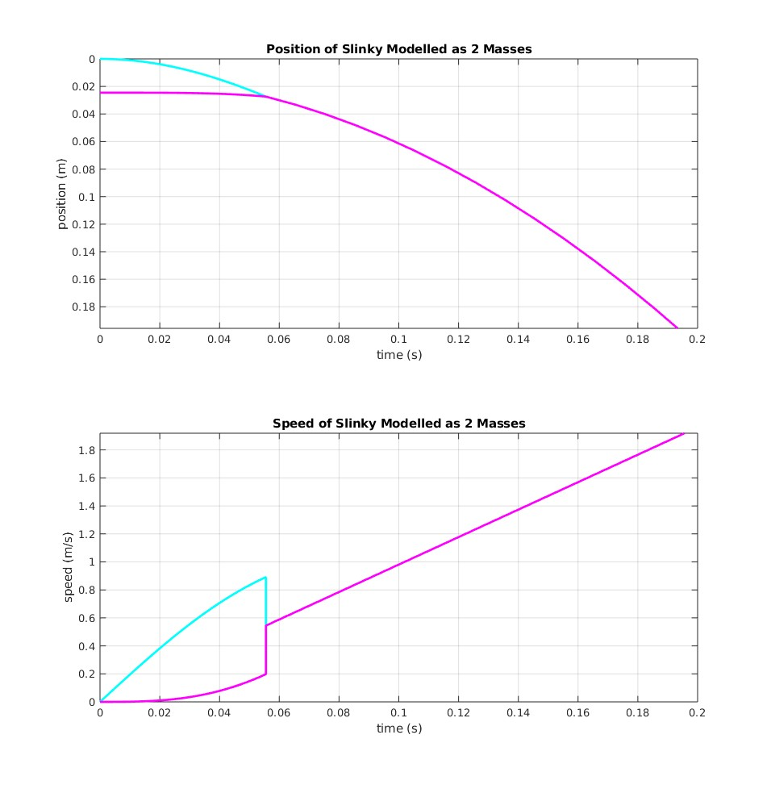
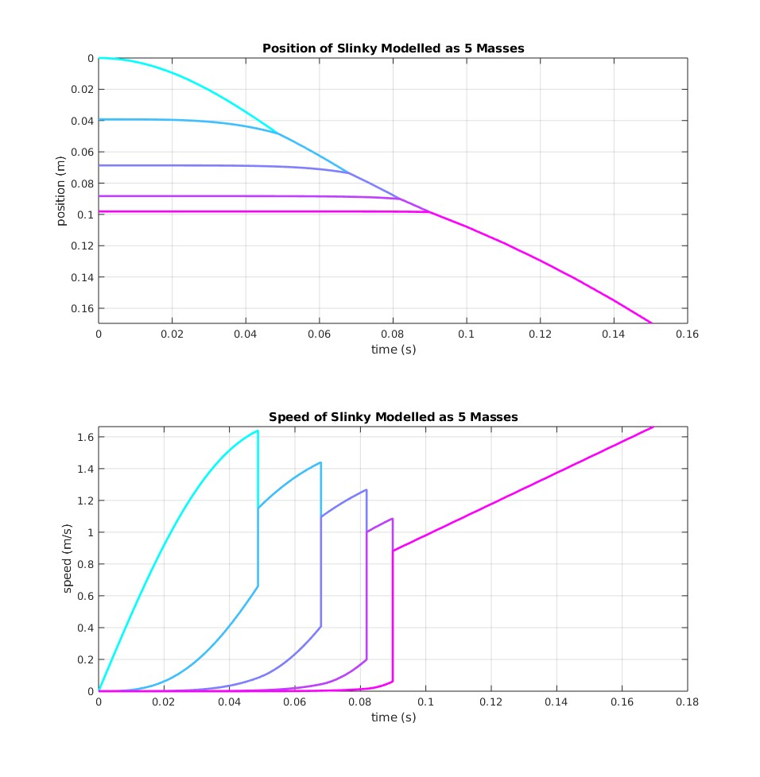
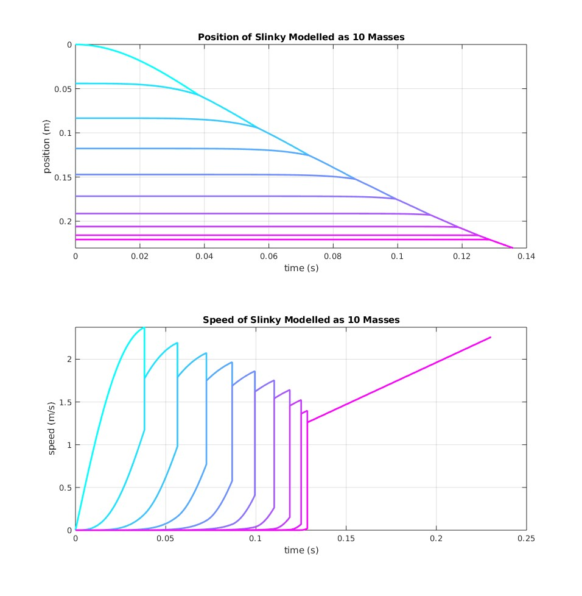

# Modelling a Slinky Drop
Oliver Buchwald and Kate McCurley

## Description
For our project, we decided to model dropping a fully extended slinky held from the top, as seen [here](https://www.youtube.com/watch?v=wGIZKETKKdw). We initially modelled this slinky as two masses attached by a spring, then extended this to modelling the slinky as a variable number of masses. The code used to create this model can be found in the file [`slinky_drop.m`](https://github.com/cmccurley22/slinky-drop/blob/main/slinky_drop.m). Also contained in this repository are videos of animations showing our results.

We also created a video summarizing our results, which can be found [here](https://youtu.be/1e-ELydujkM).

## Results
We plotted position and velocity over time of each individual mass in three different slinky models: one with 2 masses, one with 5 masses, and one with 10 masses. Ultimately, the behavior was similar but with more masses added you were able to better see how the slinky really compresses from the top down to the bottom.

### Two Mass Slinky Model
Parameters: \
k (spring constant): 20 \
N (number of masses): 2 \
m (total slinky mass): .1kg

### Five Mass Slinky Model
Parameters: \
k (spring constant): 20 \
N (number of masses): 5 \
m (total slinky mass): .1kg

### Ten Mass Slinky Model
Parameters: \
k (spring constant): 20 \
N (number of masses): 10 \
m (total slinky mass): .1kg

## Analysis
The spring force is distributed across the spring such that it is essentially pulling each mass in towards the center, meaning that the top half are being pulled down but the bottom half are being pulled up. The spring force is strongest on the masses furthest from the center as those are the points being stretched the furthest. Thus, the force downwards increases as you move towards the top of the slinky, causing the behavior where the top of the slinky falls fastest.